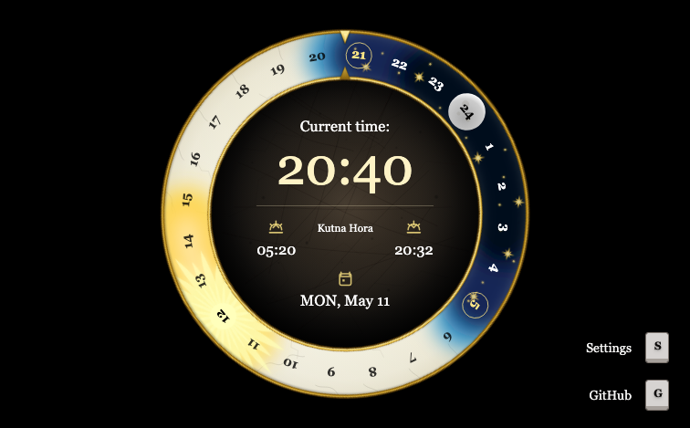

# Bohemian Day Clock

Bohemian Day Clock is a browser-based 24-hour clock with a custom-drawn dark dial, fixed pointer, SVG overlays for hour labels, daylight and night arcs, celestial markers, and a live local-time readout.

All clock artwork is drawn in this repository as custom React/SVG components. The app does not include game assets, logos, proprietary fonts, screenshots, copied art, or traced UI elements.



## Highlights

- Live 24-hour clock with a rotating overlay layer.
- Dynamic sun and night windows calculated from the selected city's coordinates.
- Sunrise and sunset labels based on IANA timezones.
- Preset city picker with the browser's current timezone shown first.
- Keyboard shortcuts for settings (`S`) and the GitHub link (`G`).
- Built-in independent time, timezone, and solar calculations.
- Single-file production build: CSS and JavaScript are inlined into `public/index.html`.

## Quick Start

Requirements: Node.js and npm.

```sh
npm install
npm run start
```

Parcel serves the app at `http://localhost:8000`.

## Usage

Open the clock and let it resolve your browser timezone automatically, or use **Settings** to choose another city. The selected city is saved in `localStorage`, so the clock reopens with the same daylight window next time.

The clock face stays fixed while the SVG overlay rotates once per day. Daylight, night, sun, moon, hour labels, and the readout are rendered from the current time plus the selected city's sunrise and sunset window.

## Scripts

```sh
npm run start
npm run typecheck
npm run build
```

- `start`: runs the Parcel dev server.
- `typecheck`: runs TypeScript without emitting files.
- `build`: builds to `public/`, then inlines generated CSS and JS into `public/index.html`.

The built HTML file can be opened directly from the filesystem without a local server or deployed as a static file.

## Build Output

Production output is intentionally self-contained. Clock visuals are rendered as React SVG components, and `scripts/inline-output.mjs` folds Parcel's generated CSS and JavaScript back into `public/index.html` and removes sibling generated assets.

This keeps the release artifact simple: one HTML file that carries the app, styles, and scripts.

## Project Layout

```text
src/
  app/                 React application shell and selected-city state
  components/actions/  Reusable floating action controls
  components/clock/    Clock renderer, SVG overlays, and shared drawing helpers
  components/settings/ Settings menu and city picker
  domain/              Pure time, timezone, and solar calculations
  hooks/               React hooks
  styles/              Tailwind entry CSS
  index.html           Parcel HTML entry
  main.tsx             React bootstrap
scripts/
  inline-output.mjs    Single-file production output helper
```

See [ARCHITECTURE.md](./ARCHITECTURE.md) for the full stack and module map. See [AGENTS.md](./AGENTS.md) for maintainer and LLM-agent guidance.

## Technical Notes

- React renders the app shell and focused clock overlay components.
- TypeScript keeps runtime-independent date and solar logic in `src/domain`.
- Tailwind CSS handles layout and visual treatment.
- Parcel provides the dev server and production bundling.
- `src/components/clock/lib/clockGeometry.ts` owns the shared 1200 x 1200 SVG coordinate math.
- `src/components/clock/lib/clockSvgDefs.tsx` owns reusable SVG wrappers, filters, and definitions.

## Contributing

Issues and pull requests are welcome. Keep changes focused and preserve the standalone build.

Before opening a pull request:

```sh
npm run typecheck
```

Also run the production build when changing assets, imports, Parcel configuration, or build scripts:

```sh
npm run build
```

Generated folders such as `public/`, `dist/`, `.parcel-cache/`, and `node_modules/` are intentionally ignored.

## Inspiration And Disclaimer

Bohemian Day Clock is an unofficial fan project with custom React/SVG artwork, loosely inspired by the medieval clock aesthetic in Kingdom Come: Deliverance.

This project is not affiliated with, endorsed by, sponsored by, or approved by Warhorse Studios. Kingdom Come: Deliverance and Warhorse Studios are trademarks of their respective owners.

Avoid adding third-party logos, game screenshots, proprietary fonts, copied art, traced UI elements, or character/place names from commercial games.

## License

ISC, as declared in [package.json](./package.json).
